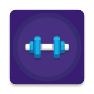
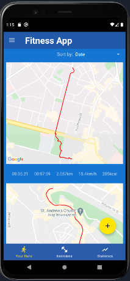
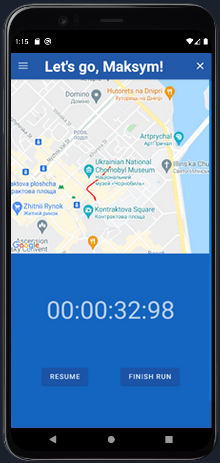
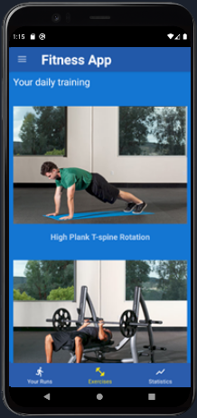
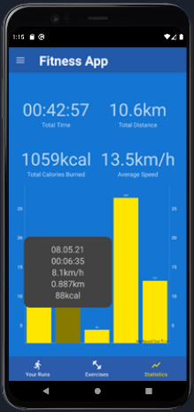

# FitnessApp

> 3rd year Course work. Fitness app with runs tracking using Google Maps, exercises viewing and caching them on the device. 

## Technologies Used
- Kotlin
- Coroutines
- Architectural Components
- Retrofit2
- Room
- Hilt
- WorkManager
- Google Maps SDK

## Features
- Tracking runs in foreground with route displaying in integrated Google Maps 
- Tracking runs in background using service
- Exercises viewing, loaded from server
- Updating exercises one time a day and caching them in internal device storage
- Displaying statiscs and graph

## Screenshots

